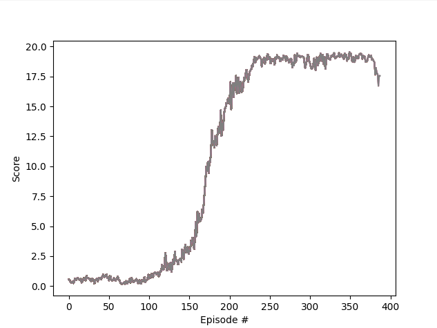

# Implementation details
___

__TODO__

## Plot of rewards

### DDPG

#### Utilized hyperparameters

| Parameter                  | Value   |
|----------------------------|---------|
| gamma `γ`                  | 0.95    |
| tau `τ`                    | 0.001   |
| learning rate `µ` (actor)  | 0.0001  |
| learning rate `µ` (critic) | 0.001   |
| buffer size                | 250,000 |

### Model architecture

__TODO__

## Ideas for improvements

- Trying another algorithm, e.g. Trust Region Policy Optimization (TRPO), Proximal Policy Optimization (PPO) 
or Distributed Distributional Deterministic Policy Gradients (D4PG)
- Improve training process by applying Prioritized Experience Replay
- Use tool to optimize hyperparameters (such as Optuna)

[[1] Trust Region Policy Optimization](https://arxiv.org/abs/1502.05477)  
[[2] Proximal Policy Optimization Algorithms](https://arxiv.org/abs/1707.06347)  
[[3] Distributed Distributional Deterministic Policy Gradients](https://openreview.net/forum?id=SyZipzbCb)
