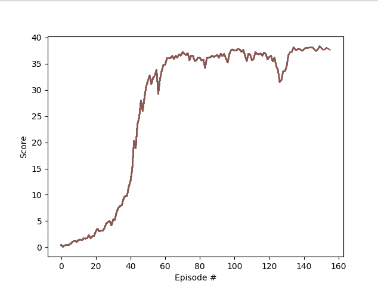

# Implementation details
___

In order to solve this problem Deep Deterministic Policy Gradient (DDPG) method was employed. 
Algorithm is depicted on below picture [1]:  

## Plot of rewards

### DDPG

Problem goal was reached at __156th episode__.

#### Utilized hyperparameters

| Parameter                  | Value                      |
|----------------------------|----------------------------|
| timestamps per episode     | 1,000                      |
| gamma `γ`                  | 0.99                       |
| tau `τ`                    | 0.001                      |
| learning rate `µ` (actor)  | 0.0001                     |
| learning rate `µ` (critic) | 0.003                      |
| buffer size                | 100,000                    |
| minibatch size             | 256                        |
| optimize every timestamps  | 20                         |
| optimization loops         | 10                         |

### Model architecture

To resolve this problem following MLP architectures were employed:   

#### Actor network:  

#### Critic network:  

## Ideas for improvements

- Trying another algorithm, e.g. Trust Region Policy Optimization (TRPO) [2], Policy Proximal Optimization (PPO) [3]
or Distributed Distributional Deterministic Policy Gradients (D4PG) [4]
- Use tool to optimize hyperparameters (such as Optuna)

[[1] Continuous control with deep reinforcement learning](https://arxiv.org/abs/1509.02971)  
[[2] Trust Region Policy Optimization](https://arxiv.org/abs/1502.05477)  
[[3] Proximal Policy Optimization](https://arxiv.org/abs/1707.06347)  
[[4] Distributed Distributional Deterministic Policy Gradients](https://openreview.net/forum?id=SyZipzbCb)  
